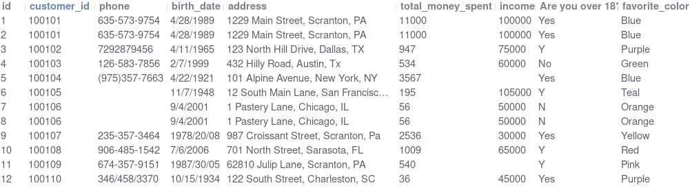
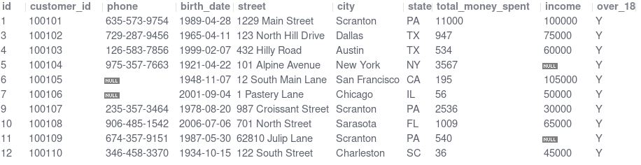
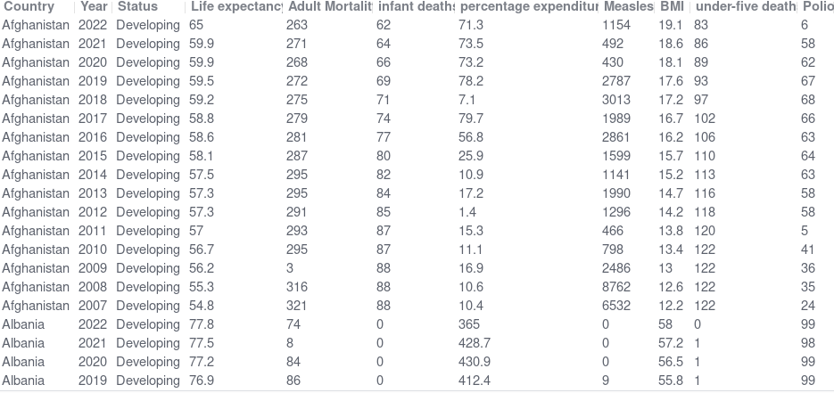

# SQL Scripts for Data Analysis

These are SQL scripts to load, clean and explore dataset.

Using : 
- MySQL 8.0.43
- MySQL Workbench 8.0


## Customer Data Cleaning

```
1_customer_data_cleaning.sql
```

Data cleaning is the foundational step in any data analysis process. In this project, I cleaned customer data using SQL by removing duplicates, handling missing values, standardizing formats, and splitting columns for better usability.

#### BEFORE CLEANING


#### AFTER CLEANING


## World Life Expectancy

```
2_world_life_expectancy.sql
```



This SQL script carries out data cleaning and Exploratory Data Analysis (EDA) on the world life expectancy data set. In the data cleaning process, duplicates are dropped and missing values are imputed from other entries. The findings from the EDA are :
- Haiti and Zimbabwe had the highest life expectancy increase in the last 15 years.
- The global average life expectancy is increasing each year.
- Richer countries have a higher life expectancy.
- Developed countries have a higher life expectancy than developing ones.
- A Higher BMI is positively correlated with a higher life expectancy.


