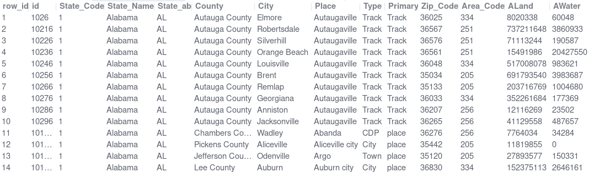
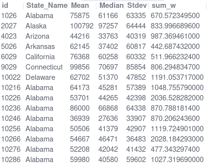

# SQL Scripts for Data Analysis

This repository contains SQL scripts for data cleaning and exploratory analysis across diverse datasets, including customer data, global life expectancy, and US household income. 

**Tools Used**
- MySQL 8.0.43
- MySQL Workbench 8.0

**Key Features**
- Data cleaning : duplicate removal, format standardization, missing value imputation, columns splitting.
- Exploratory Data Analysis : identify trends and correlations.
- Automated data cleaning via stored procedures and scheduled events.

Ideal for learning SQL-based data preparation and analysis workflows.


## Customer Data Cleaning

```
1_customer_data_cleaning.sql
```

Data cleaning is the foundational step in any data analysis process. This project demonstrates SQL techniques to prepare customer data—removing duplicates, filling missing values, standardizing formats, and splitting columns for better usability.

**BEFORE CLEANING**


**AFTER CLEANING**


## World Life Expectancy

```
2_world_life_expectancy.sql
```


This SQL script cleans global life expectancy data by removing duplicates and imputing missing values. Key insights from the Exploratory Data Analysis (EDA) include:
- Haiti and Zimbabwe saw the highest 15-year life expectancy gains.
- Global life expectancy rises steadily each year.
- Wealthier and developed nations tend to have a higher life expectancy.
- Higher BMI correlates with longer lifespans.


## US Household Income

```
3_US_household_income.sql
```




This project cleans and analyzes US household income data by state and city, revealing key trends:
- Geography: Texas & California lead in land area; Michigan has the most water.
- Income disparities: The top/bottom 10 states show stark contrasts in household income.
- There is an uneven distribution of household income in wealthier regions.
- Urban divide: Municipal residents earn more, while urban/community incomes lag significantly.


## Automated Data Cleaning

```
4_automated_data_cleaner.sql
```

This project automates data cleaning using SQL: a stored procedure creates a sanitized table, processes raw data, adds timestamps, and aggregates results. A scheduled event triggers this pipeline every 30 days for maintenance-free updates.


